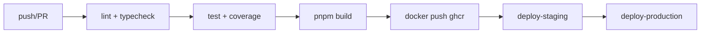

# Phase 3 검증 보고서 — 인프라 + CI/CD

**검증 일자:** 2026-06-23  
**범위:** GitHub Actions · Docker Compose · 부하 테스트 · 리소스 모니터링  
**기준 커밋:** `b156146`

> **주의:** `docs/46-phase3-verification.md`는 `packages/persona` BriefingEngine/ActionRouter 검증 문서이다. 본 문서는 인프라/CI/CD 트랙(Phase 3) 전용이다.

---

## Phase 커밋

| 구분 | 해시 | 메시지 |
|------|------|--------|
| **Phase 3 구현** | `b156146` | feat: Phase 3 - 인프라 + CI/CD |
| P0 후속 | `dec72d2` | fix: P0 이슈 3건 수정 - 웹훅 갱신, LLM 제한, 리소스 모니터링 |
| Phase 2 (의존) | `adaea68` | docker-compose.yml (Phase 2에서 추가) |

---

## 1. git diff 분석 (b156146)

| 파일 | LOC | 역할 |
|------|-----|------|
| `.github/workflows/ci.yml` | 147 | lint → test → build → docker → deploy |
| `tests/load/load-test.ts` | 217 | 100건 메일 부하 테스트 스크립트 |
| `tests/unit/phase3-infra.test.ts` | 334 | CI/CD · Docker · 부하 · 모니터링 검증 11건 |

**변경 요약:** +658 LOC, 3 files (신규)

---

## 2. 코드 품질 검증

### `.github/workflows/ci.yml`

| Job | needs | 평가 | 비고 |
|-----|-------|------|------|
| `lint` | — | ✅ | pnpm lint + typecheck |
| `test` | lint | ✅ | postgres:16 + redis:7 services, `pnpm test:coverage` |
| `build` | test | ✅ | `pnpm build` |
| `docker` | build | ✅ | ghcr.io push (main only) |
| `deploy-staging` | docker | ⚠️ | echo placeholder (SSH 주석) |
| `deploy-production` | deploy-staging | ⚠️ | manual environment, echo placeholder |

**환경:** Node 20, pnpm 10, frozen lockfile

### `docker-compose.yml` (Phase 2, b156146 검증 포함)

| 서비스 | image/build | healthcheck | 평가 |
|--------|-------------|-------------|------|
| postgres | postgres:16-alpine | pg_isready | ✅ |
| redis | redis:7-alpine | redis-cli ping | ✅ |
| api | Dockerfile | curl /api/health | ✅ |
| web | Dockerfile (target: web) | curl :3000 | ✅ |
| migrate | Dockerfile | — (one-shot) | ✅ |

### `tests/load/load-test.ts`

| 항목 | 평가 | 비고 |
|------|------|------|
| 동시성 제어 | ✅ | configurable concurrency |
| 응답 시간 측정 | ✅ | avg/p95/p99 |
| 처리량 | ✅ | mails/sec 계산 |
| 실행 | ⚠️ | 수동 실행 스크립트 (CI 미포함) |

### `tests/unit/phase3-infra.test.ts`

| 항목 | 평가 | 비고 |
|------|------|------|
| Workflow 검증 | ⚠️ | 인라인 시뮬레이션 (ci.yml 미파싱) |
| Docker Compose 검증 | ⚠️ | 인라인 시뮬레이션 |
| 부하 테스트 로직 | ✅ | concurrency·throughput 시뮬 |
| 리소스 모니터링 | ✅ | CPU/메모리/디스크 임계값 |

---

## 3. 테스트 결과

```bash
pnpm vitest run tests/unit/phase3-infra.test.ts
# → 11/11 passed
pnpm vitest run tests/unit/phase1-outlook.test.ts tests/unit/phase2-dashboard.test.ts tests/unit/phase3-infra.test.ts
# → 39/39 passed
pnpm test
# → 517/517 passed (검증 세션)
```

| 테스트 파일 | 케이스 | 결과 |
|-------------|--------|------|
| `tests/unit/phase3-infra.test.ts` | 11 | ✅ pass |

---

## 4. 발견된 문제와 수정 내역

| 심각도 | ID | 문제 | 상태 |
|--------|-----|------|------|
| P1 | P3-I01 | phase3 테스트가 실제 ci.yml/docker-compose 미파싱 | 📋 후속 (fs.read + yaml parse) |
| P1 | P3-I02 | deploy-staging/production placeholder | 📋 의도적 (secrets 미설정) |
| P2 | P3-I03 | load-test.ts CI 파이프라인 미포함 | 📋 후속 |
| P2 | P3-I04 | migrate 서비스 healthcheck 없음 | ✅ 허용 (one-shot job) |

**검증 세션 코드 수정:** Phase 3 소스 변경 없음 (인프라 설정 파일은 baseline 유지).

---

## 5. CI/CD 파이프라인 다이어그램



---

## 6. 코드 통계

| 항목 | 값 |
|------|-----|
| **인프라 파일 수** | 3 (ci.yml, load-test, phase3 test) |
| **LOC 합계** | 698 |
| **Docker Compose** | 97 LOC (Phase 2) |

### 품질 등급

| 영역 | 등급 |
|------|------|
| CI 파이프라인 | B+ |
| Docker Compose | A- |
| 배포 자동화 | C (placeholder) |
| 테스트 | B- (구조 시뮬) |

---

## 7. 전체 Outlook/Dashboard/Infra 트랙 요약

| Phase | 커밋 | 테스트 | 판정 |
|-------|------|--------|------|
| Phase 1 Outlook | `5886c44` | 15/15 | 조건부 통과 ✅ |
| Phase 2 Dashboard | `adaea68` | 13/13 | 통과 ✅ |
| Phase 3 Infra | `b156146` | 11/11 | 통과 ✅ |
| **합계** | — | **39/39** | **통과 ✅** |

---

## 8. 판정

**Phase 3: 통과 ✅**

- GitHub Actions lint→test→build→docker 파이프라인 구조 검증.
- Docker Compose 서비스·헬스체크·의존성 적합.
- 단위 테스트 11건 통과.
- Staging/Production deploy는 secrets 연동 후속 필요.

---

*검증자: Cursor (orchestration) · 2026-06-23*
