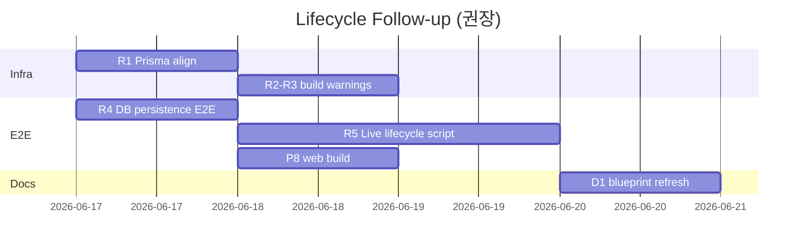

# Lifecycle Remediation & Remaining Plan — 2026-06-16

## 해결한 문제 (이번 세션)

| # | 문제 | 원인 | 조치 | 결과 |
|---|------|------|------|------|
| 1 | `pnpm install` → `ENOTDIR` on `packages/infrastructure/llm` | `packages/infrastructure/.ignored_llm`가 동일 패키지명(`@aios/infrastructure/llm`)으로 workspace에 중복 등록되어 `llm`이 깨진 symlink로 대체됨 | `pnpm-workspace.yaml`에 `!packages/infrastructure/.ignored_llm` 추가, `git checkout`으로 `llm` 복원 | `pnpm install` 정상 |
| 2 | Portal `:3110` 503 / Next.js `MODULE_NOT_FOUND` | 손상된 `node_modules` (불완전 reinstall) | 루트 `node_modules` 전체 삭제 후 `pnpm install` | Next.js 16.2.9 정상 기동 |
| 3 | AIOS v1 `:3101` timeout | 별도 repo `AIOS v1`의 Next.js `ERR_INVALID_PACKAGE_CONFIG` | `AIOS v1`에서 `node_modules` 재설치 | `:3101/api/health` 200 |
| 4 | `integration.test.ts` beforeAll timeout | 무거운 dynamic import, 기본 10s hook 제한 | `vitest.config.ts`에 `hookTimeout: 30_000` | 14 tests PASS |
| 5 | integrations health 테스트 503 기대 불일치 | mock이 모든 health URL에 200 반환 → route 로직상 `ok` (200)이 맞음 | 테스트 기대값을 200/`ok`로 수정 | PASS |
| 6 | integration stack partial health | 위 1–3번 복합 | stack stop → reinstall → stack restart | **7/7 서비스 200** |

### 검증 스냅샷 (2026-06-16 15:10 KST)

```text
3010 mail/outlook        200
3101 aios-v1             200
3110 portal/integrations 200
3201 f-aios-v3           200
3500 sangfor             200
4000 vibe                200
3600 whelp99-bridge      200
```

```bash
pnpm integration:stack:wait          # 7/7 ready
pnpm exec vitest run tests/integration.test.ts           # 14 PASS
pnpm exec vitest run tests/lifecycle-workflow.test.ts      # 18 PASS
pnpm exec vitest run tests/integration/outlook-proxy.test.ts  # 14 PASS
pnpm --filter @aios/web typecheck      # PASS
```

### 변경 파일 (미커밋)

- `pnpm-workspace.yaml` — `.ignored_llm` workspace 제외
- `vitest.config.ts` — `hookTimeout`
- `tests/integration.test.ts` — health mock 기대값 정정

---

## 아직 진행 안 된 항목

### P0 — 인프라 / 품질 (단기)

| ID | 항목 | 설명 | 담당 | 예상 |
|----|------|------|------|------|
| R1 | Prisma 버전 정렬 | `prisma@6.0.0` CLI vs `@prisma/client@6.19.3` 불일치 경고 | opencode | 0.5d |
| R2 | `pnpm approve-builds` | prisma/sharp/esbuild postinstall 스크립트 승인 또는 `onlyBuiltDependencies` 등록 | opencode | 0.25d |
| R3 | `next.config.js` 경고 | `experimental.turbo` invalid key, turbopack.root 상대경로 | opencode | 0.25d |
| R4 | lifecycle DB E2E | API mutation → `lifecycle_records` 행 검증 (raw SQL smoke 외 앱 경로) | opencode + Cursor evidence | 0.5d |
| R5 | Live lifecycle E2E 스크립트 | C10: mail analyze → reply draft → CRM candidate → Opportunity → … → ImprovementTask | opencode | 1d |

### P1 — 제품 갭 (blueprint 미완)

| ID | 항목 | 현재 상태 | 목표 |
|----|------|-----------|------|
| P1 | Kanban 실데이터 | mock | `/api/tasks` 연동 |
| P2 | CRM candidate **활성화** UI | candidate 생성만 | approval-gated active 전환 |
| P3 | Mail reply-draft live | proxy + UI 있음 | 실제 Outlook upstream E2E |
| P4 | F-aios-v3 agent-task 실행 | API/use case 있음 | live workflow run + evidence |
| P5 | Vibe improvement-task 링크 | ingest API 있음 | maintenance case → vibe task smoke |
| P6 | Sangfor device-control | gate 있음 | live device validation (승인 필요) |
| P7 | GitHub / Slack live | 설정 UI | token/webhook-backed smoke |
| P8 | `pnpm --filter @aios/web build` | 미실행 | production build PASS |

### P2 — 문서 / 운영

| ID | 항목 |
|----|------|
| D1 | `product-integration-blueprint-status.md` — live stack 7/7 반영, Progress % 재산정 |
| D2 | `docs/evidence/lifecycle-live-e2e-2026-06-16.md` 신규 (R5 완료 후) |
| D3 | `.ignored_llm` — workspace 제외만으로 충분한지 확인; 필요 시 rename 또는 `.gitignore` 정리 |
| D4 | AIOS v1 repo — integration stack 시작 전 `node_modules` 건강 체크를 stack script에 optional hook으로 추가 검토 |

---

## 실행 계획 (권장 순서)

### Week 1 — 안정화 + E2E



1. **Day 1** — R1 Prisma 버전 통일 (`packages/db` devDep + client 동일 minor), `pnpm rebuild @prisma/client`
2. **Day 1–2** — R4 lifecycle API → PostgreSQL round-trip 테스트 (`tests/lifecycle-persistence.test.ts`)
3. **Day 2–4** — R5 `scripts/lifecycle-live-e2e.mjs` (stack wait → HTTP 시퀀스, approval 409 assert)
4. **Day 3** — P8 `pnpm --filter @aios/web build` + R2/R3 경고 제거
5. **Day 5** — D1 blueprint 갱신, D2 evidence

### Week 2 — 제품 UI 갭

1. **P1** Kanban → tasks API (opencode assignment)
2. **P2** CRM candidate activation flow (approval gate 연동)
3. **P3** Mail reply-draft live smoke (Mail Intelligence `:3010` 연동)

### Week 3 — Upstream live validation

1. **P4** F-aios-v3 agent-task run
2. **P5** Vibe improvement-task
3. **P6–P7** Sangfor / GitHub / Slack (승인 게이트 하에)

---

## opencode 핸드오프 (다음 assignment)

```yaml
phase: lifecycle-follow-up-1
owner: opencode
targetFiles:
  - packages/db/package.json
  - packages/db/prisma/schema.prisma
  - tests/lifecycle-persistence.test.ts
  - scripts/lifecycle-live-e2e.mjs
acceptance:
  - prisma generate without version mismatch warning
  - lifecycle API POST persists row readable via GET/summary
  - lifecycle-live-e2e.mjs exits 0 with integration:stack running
  - pnpm --filter @aios/web build passes
```

---

## 재발 방지 체크리스트

- `pnpm install` 전: `file packages/infrastructure/llm` → `directory` 확인
- integration stack 실패 시: portal.log + aios-v1.log에서 Next.js 에러 먼저 확인
- duplicate workspace package 이름 금지 (`.ignored_*` 백업은 workspace 제외)
- AIOS v1은 별도 repo — portal reinstall만으로는 v1 Next.js가 고쳐지지 않음
