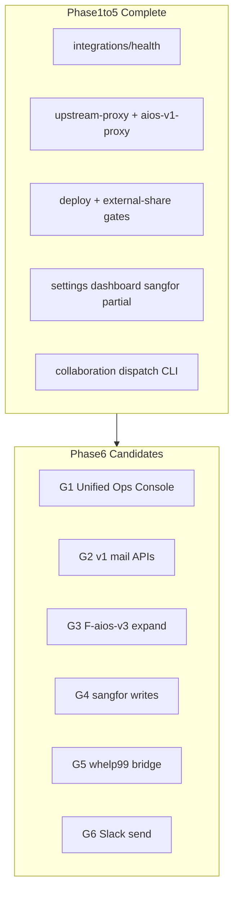

# Product Integration Blueprint Status

> **Last updated:** 2026-06-14  
> **Session:** `cursor-opencode-main-session`  
> **Integration phase:** 7 completed (opencode + Cursor Agent + Codex)  
> **Verification (2026-06-14):** 67 web API routes, connector routes on `apps/web`, 394 tests passing, `pnpm lint` + `pnpm typecheck` + `pnpm build` PASS. `/ops` and `/vibe-coding` HTTP smoke PASS; `/api/integrations/health` returns structured 503 when upstreams are down.

**Canonical document** for integration-scope products. Supersedes stale timeline/checklist entries in older reports (see [Stale Doc Index](#stale-doc-index)).

---

## Blueprint References

| Layer            | Document                                                                                                                     | Scope                                                         |
| ---------------- | ---------------------------------------------------------------------------------------------------------------------------- | ------------------------------------------------------------- |
| Product vision   | [`.hermes/plans/2026-06-11_010000-aios-brainstorming.md`](../../.hermes/plans/2026-06-11_010000-aios-brainstorming.md)       | 5 capabilities: mail, knowledge, agents, code, self-evolution |
| Real integration | [`.hermes/plans/2026-06-11_020000-real-integration-plan.md`](../../.hermes/plans/2026-06-11_020000-real-integration-plan.md) | ~30 AIOS v1 API proxies, auth, dashboard                      |
| Execution phases | [`cursor-opencode-collaboration.md`](cursor-opencode-collaboration.md), [`phase5-handoff.md`](phase5-handoff.md)             | Phases 1–5: health, proxy, gates, live UI, deep integration   |
| Registry         | [`packages/shared/src/constants/integrations.ts`](../../packages/shared/src/constants/integrations.ts)                       | 5 upstream targets + env keys                                 |

---

## How to Read Progress

Each product is scored on four axes (each 0–100%, combined into overall **Progress**):

| Axis       | Meaning                                                                   |
| ---------- | ------------------------------------------------------------------------- |
| **Health** | Probe via `/api/integrations/health` or dedicated health route            |
| **Proxy**  | Portal API routes proxying upstream (vs Hermes/blueprint planned surface) |
| **UI**     | User-facing pages showing live data (not hardcoded/mock)                  |
| **Gate**   | Approval gate on dangerous writes (`deploy`, `external-share`, etc.)      |

**Progress** = weighted average: Health 15%, Proxy 35%, UI 30%, Gate 20% (Gate N/A → excluded from average for that product).

---

## Summary Dashboard

| Product               | Progress | Health | Proxy | UI  | Gate | Next Priority               |
| --------------------- | -------- | ------ | ----- | --- | ---- | --------------------------- |
| AIOSv2 Portal (Hub)   | 78%      | 95%    | 90%   | 75% | 90%  | Browser/live UX smoke       |
| AIOS v1               | 58%      | 100%   | 60%   | 50% | 50%  | unified mail hub UI         |
| F-aios-v3-core        | 45%      | 100%   | 55%   | 10% | 50%  | workflows UI source clarity |
| sangfor-mcp-workflow  | 62%      | 100%   | 70%   | 45% | 80%  | live device validation      |
| vibe-coding-os        | 64%      | 100%   | 75%   | 60% | 80%  | live RAG search smoke       |
| whelp99 MCP           | 45%      | 70%    | 55%   | 15% | 80%  | real MCP HTTP endpoint      |
| Outlook / Mail        | 55%      | 70%    | 60%   | 70% | 50%  | unified mail hub UI         |
| GitHub                | 50%      | 50%    | 55%   | 25% | 80%  | token-backed live PR smoke  |
| Slack                 | 45%      | 50%    | 55%   | 25% | 90%  | live send approval smoke    |
| Collaboration Runtime | 75%      | —      | 85%   | 60% | 95%  | job progress visibility     |

**Integration-scope weighted average:** ~58% (product vision) / ~82% (Hermes real-integration plan) / Phase 1–7 build/test/evidence **complete**.

---

## 1. AIOSv2 Portal (Hub)

**Blueprint goal:** API Gateway + unified dashboard + shared auth; single entry for all AIOS capabilities ([brainstorming](../../.hermes/plans/2026-06-11_010000-aios-brainstorming.md), [real-integration plan](../../.hermes/plans/2026-06-11_020000-real-integration-plan.md)).

### 진행 (Done)

- Integration registry and multi-project health: [`/api/integrations/health`](../../apps/web/src/app/api/integrations/health/route.ts), [`project-health-probe.ts`](../../packages/infrastructure/src/integrations/project-health-probe.ts)
- Shared proxy infrastructure: [`upstream-proxy.ts`](../../apps/web/src/lib/integrations/upstream-proxy.ts), [`approval-gate.ts`](../../apps/web/src/lib/integrations/approval-gate.ts)
- UI pages: `/dashboard`, `/settings`, `/mail`, `/workflows`, `/sangfor`, `/collaboration`, `/kanban`
- Settings integrations tab: live health + Outlook/GitHub/Slack status
- CI: [`.github/workflows/ci.yml`](../../.github/workflows/ci.yml)
- 32 Next.js API routes under [`apps/web/src/app/api/`](../../apps/web/src/app/api/)

### 미진 (Not done)

- **Unified Ops Console** — health, agents, approvals, phase dispatch split across dashboard / settings / collaboration
- **Kanban** uses local mock cards, not `/api/tasks` ([`kanban-board.tsx`](../../apps/web/src/components/kanban/kanban-board.tsx))
- **Shared DB** — Prisma schema exists; portal data not persisted or synced with upstreams
- **Phase dispatch** — CLI only: `pnpm collaboration:continue`, `pnpm collaboration:dispatch-opencode` ([`scripts/dispatch-opencode-phase5.ts`](../../scripts/dispatch-opencode-phase5.ts))

### 개선사항

| Priority | Item                                                                         |
| -------- | ---------------------------------------------------------------------------- |
| **P0**   | Single Ops view: integrations health + pending approvals + opencode dispatch |
| **P1**   | Wire Kanban to `/api/tasks` or domain workflow service                       |
| **P2**   | Shared auth/session with upstream services; remove duplicate env config      |

---

## 2. AIOS v1

**Blueprint goal:** Mail intelligence, customer/partner CRM, automation workflows, upstream source for portal ([brainstorming § AIOS v1](../../.hermes/plans/2026-06-11_010000-aios-brainstorming.md)).

**Env:** `AIOS_V1_URL` (default `http://localhost:3101`)

### 진행 (Done)

- Health probe via integrations registry
- **11 proxy routes** via [`proxyAiosV1Json`](../../apps/web/src/lib/integrations/aios-v1-proxy.ts):

| Portal route      | Upstream                                  |
| ----------------- | ----------------------------------------- |
| `/api/customers`  | `/api/customers`                          |
| `/api/tasks`      | `/api/tasks`                              |
| `/api/partners`   | `/api/partners`                           |
| `/api/knowledge`  | `/api/knowledge`, `/api/knowledge/search` |
| `/api/workflows`  | `/api/tasks` (mapped)                     |
| `/api/automation` | `/api/actions`                            |
| `/api/github`     | `/api/connectors`                         |
| `/api/plan`       | `/api/plan`                               |
| `/api/analyze`    | `/api/analyze`                            |
| `/api/commands`   | `/api/commands`                           |
| `/api/risk`       | `/api/risk`                               |

- UI: dashboard (customers, partners, workflows), workflows page
- Fallback UX when upstream unreachable (plan/analyze/commands/risk)

### 미진 (Not done)

Hermes plan ~30 APIs — major gaps:

| Missing proxy                             | Hermes reference                                |
| ----------------------------------------- | ----------------------------------------------- |
| `/api/mail-import`                        | Task 1.3                                        |
| `/api/mail-candidates`                    | mailApi                                         |
| `/api/mail-insight-threads`               | mailApi                                         |
| `/api/customers/[id]` GET/PUT/DELETE      | customerApi                                     |
| `/api/partners/[id]`                      | partnerApi                                      |
| `/api/workflows/[id]/execute` (native v1) | workflowApi                                     |
| `/api/knowledge/documents`                | knowledgeApi                                    |
| `/api/automation/workflows`               | automationApi (path mismatch vs `/api/actions`) |

- No approval gates on AIOS v1 write routes
- Mail intelligence not exposed through v1 proxy (Outlook path is separate)

### 개선사항

| Priority | Item                                                                      |
| -------- | ------------------------------------------------------------------------- |
| **P0**   | Batch mail-intelligence proxies (import, candidates, threads)             |
| **P1**   | `customers/[id]`, `partners/[id]` CRUD routes                             |
| **P2**   | Approval policy on v1 POST/PUT/DELETE; align automation paths with Hermes |

---

## 3. F-aios-v3-core

**Blueprint goal:** Workflow engine, knowledge graph, orchestrator, evolution, monitoring — 15 packages ([brainstorming § F-aios-v3](../../.hermes/plans/2026-06-11_010000-aios-brainstorming.md)).

**Env:** `F_AIOS_V3_URL` (default `http://localhost:3200`)

### 진행 (Done)

- Health probe + dedicated proxy:
  - [`/api/aios-v3/health`](../../apps/web/src/app/api/aios-v3/health/route.ts) → `/health`
  - [`/api/aios-v3/workflows`](../../apps/web/src/app/api/aios-v3/workflows/route.ts) → `/api/workflows`
  - [`/api/aios-v3/knowledge`](../../apps/web/src/app/api/aios-v3/knowledge/route.ts) → `/api/knowledge`, `/api/knowledge/search`
- Dashboard integrations row via `/api/integrations/health`

### 미진 (Not done)

- **15 packages** (a2a, ag-ui, evolution, hyperagents, lightrag, orchestrator, monitoring, etc.) — no portal proxy
- **Workflows UI** uses `/api/workflows` → AIOS v1 tasks, not F-aios-v3
- No F-aios-v3 dedicated UI page
- Self-evolution / RAG / benchmark capabilities not surfaced

### 개선사항

| Priority | Item                                                                       |
| -------- | -------------------------------------------------------------------------- |
| **P0**   | Clarify workflows UI data source (v1 vs v3) or add F-aios-v3 workflows tab |
| **P1**   | Proxy map for orchestrator, monitoring, lightrag endpoints                 |
| **P2**   | Package-level integration matrix in docs + settings                        |

---

## 4. sangfor-mcp-workflow

**Blueprint goal:** Security appliance workflows, compliance, MCP operator console ([integrations registry](../../packages/shared/src/constants/integrations.ts)).

**Env:** `SANGFOR_MCP_URL` (default `http://localhost:3500`)

### 진행 (Done)

| Portal route                          | Upstream                     | Gate       |
| ------------------------------------- | ---------------------------- | ---------- |
| `/api/sangfor/health`                 | `/api/system/health`         | —          |
| `/api/sangfor/workflows`              | `/api/workflows`             | —          |
| `/api/sangfor/dashboard`              | `/api/dashboard/stats`       | —          |
| `/api/sangfor/events`                 | `/api/events`                | —          |
| `/api/sangfor/compliance/trend`       | `/api/compliance/trend`      | —          |
| `/api/sangfor/workflows/[id]/execute` | `/api/workflows/:id/execute` | **deploy** |

- UI [`/sangfor`](../../apps/web/src/app/sangfor/page.tsx): workflows tab live; security tab events live with mock fallback; execute + approval flow
- Tests: events proxy smoke in [`tests/phase5-smoke.test.ts`](../../tests/phase5-smoke.test.ts)

### 미진 (Not done)

Upstream operator-console has ~25+ routes; not proxied:

- Device: `/api/device/capture-menu`, `/api/device/compare`
- Compliance POST: `/api/compliance/track`, `/api/compliance/roadmap`, `/api/compliance/proposal`
- Templates, learning, access, manual, vendors, guide generate
- **Devices / topology tabs** — mock data only in UI

### 개선사항

| Priority | Item                                                                 |
| -------- | -------------------------------------------------------------------- |
| **P0**   | Device read proxy + optional live devices tab                        |
| **P1**   | Compliance POST routes with `external-share` or `deploy` gate        |
| **P2**   | Remove mock fallback when upstream healthy; templates/learning proxy |

---

## 5. vibe-coding-os

**Blueprint goal:** Learning system, RAG, agent framework ([integrations registry](../../packages/shared/src/constants/integrations.ts)).

**Env:** `VIBE_CODING_OS_URL` (default `http://localhost:4000`)

### 진행 (Done)

| Portal route                  | Upstream          | Gate               |
| ----------------------------- | ----------------- | ------------------ |
| `/api/vibe-coding/health`     | `/api/health`     | —                  |
| `/api/vibe-coding/projects`   | `/api/projects`   | —                  |
| `/api/vibe-coding/rag/ingest` | `/api/rag/ingest` | **external-share** |

- Approval + resume tested in [`tests/integration.test.ts`](../../tests/integration.test.ts)
- Health in integrations dashboard

### 미진 (Not done)

- No dedicated UI page (not in sidebar)
- No ingest form / approval UX in portal
- Agent run, learning schedules, sandbox — not proxied

### 개선사항

| Priority | Item                                                      |
| -------- | --------------------------------------------------------- |
| **P0**   | Dashboard widget or `/vibe-coding` page for projects list |
| **P1**   | RAG ingest UI with 409 → approve → retry flow             |
| **P2**   | Agent execution and learning schedule proxies             |

---

## 6. whelp99-code-sangfor-engineer-mcp

**Blueprint goal:** Sangfor engineer MCP extension ([integrations registry](../../packages/shared/src/constants/integrations.ts)).

**Env:** `WHELP99_MCP_PATH` (filesystem probe), `WHELP99_MCP_HTTP_URL` (web bridge)

### 진행 (Done)

- Filesystem probe in [`project-health-probe.ts`](../../packages/infrastructure/src/integrations/project-health-probe.ts)
- [`GET /api/whelp99/health`](../../apps/api/src/index.ts) on API app (probeIntegrationTarget)
- Web bridge routes:
  - [`GET /api/whelp99/health`](../../apps/web/src/app/api/whelp99/health/route.ts)
  - [`GET /api/whelp99/tools`](../../apps/web/src/app/api/whelp99/tools/route.ts)
  - [`POST /api/whelp99/tools/call`](../../apps/web/src/app/api/whelp99/tools/call/route.ts)
- Settings integrations row (`planned` / `unreachable`)
- Tests in [`tests/phase5-smoke.test.ts`](../../tests/phase5-smoke.test.ts) and [`tests/integration/phase6-connectors.test.ts`](../../tests/integration/phase6-connectors.test.ts)

### 미진 (Not done)

- Real MCP HTTP service must be configured with `WHELP99_MCP_HTTP_URL`.
- Portal UI does not yet expose a generic tool-call form.

### 개선사항

| Priority | Item                                                 |
| -------- | ---------------------------------------------------- |
| **P1**   | Connect a real MCP HTTP endpoint and run live smoke  |
| **P2**   | Add portal tool-call UI with approval queue handoff  |
| **P3**   | Keep filesystem probe as fallback diagnostics source |

---

## 7. Outlook / Mail

**Blueprint goal:** Mail intelligence — classification, candidates, auto-processing ([brainstorming § 메일](../../.hermes/plans/2026-06-11_010000-aios-brainstorming.md)).

### 진행 (Done)

| Portal route                  | Upstream                  |
| ----------------------------- | ------------------------- |
| `/api/proxy/outlook/status`   | Mail intelligence service |
| `/api/proxy/outlook/messages` | Mail intelligence service |

- UI: [`/mail`](../../apps/web/src/app/mail/page.tsx), dashboard mail widget
- Settings: Outlook connected status
- AIOS v1 mail routes:
  - [`POST /api/mail-import`](../../apps/web/src/app/api/mail-import/route.ts)
  - [`GET/POST /api/mail-candidates`](../../apps/web/src/app/api/mail-candidates/route.ts)
  - [`GET/POST /api/mail-insight-threads`](../../apps/web/src/app/api/mail-insight-threads/route.ts)
- Tests in [`tests/integration/aios-v1-mail-proxy.test.ts`](../../tests/integration/aios-v1-mail-proxy.test.ts)

### 미진 (Not done)

- Single “mail hub” merging Outlook + v1 intelligence
- Candidate approval workflow UI

### 개선사항

| Priority | Item                                            |
| -------- | ----------------------------------------------- |
| **P1**   | Unified mail page tabs: Outlook + v1 candidates |
| **P2**   | Candidate approve/reject with approval gate UI  |

---

## 8. GitHub

**Blueprint goal:** Code repository integration; domain Phase 4 PR automation interfaces ([`deferred-items.md`](deferred-items.md) — Octokit deferred).

### 진행 (Done)

- [`/api/github`](../../apps/web/src/app/api/github/route.ts) → AIOS v1 `/api/connectors` (GitHub connector subset)
- [`POST /api/github/branches`](../../apps/web/src/app/api/github/branches/route.ts) → GitHub REST branch creation with `external-share` gate
- [`POST /api/github/pull-requests`](../../apps/web/src/app/api/github/pull-requests/route.ts) → GitHub REST PR creation with `external-share` gate
- Settings: `connected` from API response
- NextAuth GitHub provider ([`apps/web/src/lib/auth/index.ts`](../../apps/web/src/lib/auth/index.ts))
- Tests in [`tests/integration/phase6-connectors.test.ts`](../../tests/integration/phase6-connectors.test.ts)

### 미진 (Not done)

- Commit creation, merge, push, and tag operations are intentionally not implemented.
- PR automation UI
- Portal GitHub auth not linked to v1 connector tokens

### 개선사항

| Priority | Item                                             |
| -------- | ------------------------------------------------ |
| **P1**   | Token-backed live branch/PR smoke with approval  |
| **P2**   | Wire domain PR automation models to portal UI    |
| **P3**   | Add commit creation only after approval contract |

---

## 9. Slack

**Blueprint goal:** Team notifications and alerts.

### 진행 (Done)

- [`/api/slack/status`](../../apps/web/src/app/api/slack/status/route.ts) (web) + [`apps/api/src/index.ts`](../../apps/api/src/index.ts) — env: `SLACK_WEBHOOK_URL`, `SLACK_BOT_TOKEN`
- [`POST /api/slack/send`](../../apps/web/src/app/api/slack/send/route.ts) with `send` approval gate
- Settings: connected / unreachable display
- Tests in [`tests/integration/phase6-connectors.test.ts`](../../tests/integration/phase6-connectors.test.ts)

### 미진 (Not done)

- Bot workflows, channel management
- Live webhook send smoke requires explicit approval.

### 개선사항

| Priority | Item                                                 |
| -------- | ---------------------------------------------------- |
| **P1**   | Live webhook send smoke through approval flow        |
| **P2**   | Notification templates; link to automation workflows |

---

## 10. Collaboration Runtime (Cursor / opencode / Codex)

**Blueprint goal:** Multi-agent orchestration with shared state, handoffs, approval ([`cursor-opencode-collaboration.md`](cursor-opencode-collaboration.md)).

### 진행 (Done)

- Session state: [`.aios/context/collaboration-state.json`](../../.aios/context/collaboration-state.json)
- Approval queue: [`.aios/context/approval-queue.json`](../../.aios/context/approval-queue.json)
- APIs: `/api/collaboration/sessions`, `/execute`, `/assignments/[id]/resume`, `/api/approvals`
- UI: [`/collaboration`](../../apps/web/src/app/collaboration/page.tsx) — sessions, assignments, approvals, cursor/opencode trigger
- Evidence: [`docs/evidence/cursor-opencode-main-session.md`](../evidence/cursor-opencode-main-session.md)
- CLI: `pnpm collaboration:run`, `collaboration:continue`, `collaboration:dispatch-opencode`, `collaboration:dispatch-cursor-agent`
- Phases 1–7 assignments **done** for build/test/evidence scope
- Gated proxy integration with [`approval-gate.ts`](../../apps/web/src/lib/integrations/approval-gate.ts)

### 미진 (Not done)

- **UI phase dispatch** — `continue` / `dispatch-opencode` not exposed as portal buttons with task prompts
- **Codex dispatch** — review-only assignments recorded but no UI/API trigger
- **Auto loop** — no auto `continue` on phase completion or failure retry chain
- **Job progress** — long opencode runs (15min+) invisible in portal

### 개선사항

| Priority | Item                                                                          |
| -------- | ----------------------------------------------------------------------------- |
| **P0**   | Collaboration UI: “Dispatch Phase N to opencode” wired to dispatch script/API |
| **P1**   | Codex review trigger; assignment progress polling                             |
| **P2**   | Auto phase continue + evidence refresh on opencode completion                 |

---

## Cross-Product Gaps (Phase 6 Candidates)

Consolidated from [`phase5-handoff.md`](phase5-handoff.md) and this audit:

| ID  | Gap                                              | Products affected     |
| --- | ------------------------------------------------ | --------------------- |
| G1  | Unified Ops Console                              | Portal, Collaboration |
| G2  | AIOS v1 mail API batch (~19 routes)              | AIOS v1, Outlook/Mail |
| G3  | F-aios-v3 deep proxy map                         | F-aios-v3             |
| G4  | sangfor device/compliance POST + UI mock removal | sangfor               |
| G5  | whelp99 MCP HTTP bridge live endpoint            | whelp99               |
| G6  | Slack live send smoke                            | Slack                 |
| G7  | Browser/live UX smoke for major flows            | All                   |

---

## Code Inventory (verification snapshot)

### Web API routes (32)

`integrations/health`, `aios-v3/*`, AIOS v1 proxies (`customers`, `tasks`, `partners`, `knowledge`, `workflows`, `automation`, `github`, `plan`, `analyze`, `commands`, `risk`), `sangfor/*`, `vibe-coding/*`, `collaboration/*`, `approvals`, `proxy/outlook/*`, `slack/status`, `auth/*`

### API app extras

- `GET /api/whelp99/health`
- `GET /api/slack/status`

### Tests (25)

- [`tests/basic.test.ts`](../../tests/basic.test.ts)
- [`tests/approval-gate.test.ts`](../../tests/approval-gate.test.ts)
- [`tests/integration.test.ts`](../../tests/integration.test.ts)
- [`tests/phase5-smoke.test.ts`](../../tests/phase5-smoke.test.ts)

---

## Stale Doc Index

These documents are **historical** or **partially outdated**. Use **this file** as the source of truth for integration product status.

| Document                                                                                                 | Stale aspect                                                 | Use instead                             |
| -------------------------------------------------------------------------------------------------------- | ------------------------------------------------------------ | --------------------------------------- |
| [`final-feature-diff.md`](final-feature-diff.md)                                                         | “Development Complete” = monorepo structure, not integration | This doc                                |
| [`missing-feature-checklist.md`](missing-feature-checklist.md)                                           | UI/tests marked missing but partially implemented            | This doc + checklist for v2.0.1 backlog |
| [`.hermes/...-real-integration-plan.md`](../../.hermes/plans/2026-06-11_020000-real-integration-plan.md) | Timeline all “미시작”; Phases 3–5 done                       | This doc                                |
| [`phase5-handoff.md`](phase5-handoff.md)                                                                 | Task checklist may lag opencode completion                   | evidence + this doc                     |

---

## Related Links

- Collaboration contract: [`cursor-opencode-collaboration.md`](cursor-opencode-collaboration.md)
- Session evidence: [`docs/evidence/cursor-opencode-main-session.md`](../evidence/cursor-opencode-main-session.md)
- Integration env vars: collaboration contract § Environment Variables
