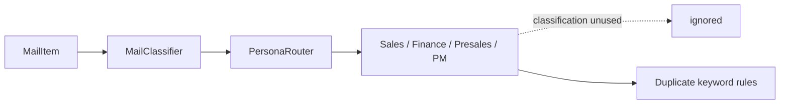

# Phase 2 페르소나 코드 리뷰

**리뷰 일자:** 2026-06-23  
**리뷰 범위:**
- `packages/persona/src/personas/sales.ts`
- `packages/persona/src/personas/finance.ts`
- `packages/persona/src/personas/presales.ts`
- `packages/persona/src/personas/pm.ts`
- `packages/persona/src/mail/classifier.ts`

**관련 테스트:**
- `packages/persona/src/mail/__tests__/classifier.test.ts` (vitest include 범위 밖 — 미실행)
- `tests/unit/phase2-personas.test.ts`
- `tests/unit/mail-classifier.test.ts`
- `tests/unit/persona-e2e.test.ts`

---

## Executive Summary

Phase 2 페르소나 모듈은 규칙 기반 메일 분류 → 페르소나별 처리 파이프라인의 **프로토타입 수준 구현**으로, 인터페이스·타입 정의와 기본 플로우는 명확하다. 다만 **실제 클래스에 대한 단위 테스트가 없고**, `tests/unit/phase2-personas.test.ts` 등은 패키지 코드와 **중복된 인라인 시뮬레이션**을 검증하고 있어 회귀 방지 효과가 제한적이다.

공통적으로 `classification` 파라미터가 전달되지만 사용되지 않으며, 키워드 매칭 로직이 `MailClassifier`와 페르소나 내부에 **이중으로 존재**한다. 에러 처리·입력 검증·구조화된 로깅은 전반적으로 부재하다.

| 파일 | 코드 품질 | 타입 안정성 | 에러 처리 | 테스트 커버리지 |
|------|-----------|-------------|-----------|-----------------|
| `classifier.ts` | B | A- | D | C (실구현 테스트 미연동) |
| `sales.ts` | C+ | B+ | D | F (직접 테스트 없음) |
| `finance.ts` | C+ | B | D | F |
| `presales.ts` | C | B+ | D | F |
| `pm.ts` | C | B+ | D | F |

**종합 등급: C+** — 동작 스켈레톤은 갖추었으나, 버그·데드 코드·테스트 공백을 Phase 3 이전에 보완할 것을 권장한다.

---

## 1. `packages/persona/src/mail/classifier.ts`

### 1.1 코드 품질 (B)

**강점**
- Zod 기반 `PersonaTypeEnum`, `ClassificationResultSchema`로 분류 결과 스키마를 명시적으로 정의.
- 규칙 기반 엔진(`ClassificationRule` + `addRule`)으로 확장 가능한 구조.
- `mapFromIngestionCategory()`로 Ingestion 레이어와의 브릿지 제공.

**약점**
- **규칙 중복:** 65–155행의 “강화 규칙”과 214–285행의 “레거시 규칙”이 동일 카테고리(SALES, FINANCE, PRESALES, PM, MARKETING)를 반복 정의. 유지보수 시 한쪽만 수정되는 drift 위험이 크다.
- **매칭 범위 불일치:** 일부 규칙은 `subject + body`, 일부는 `subject`만 검사 (`presales-tech-inquiry`, `pm-project`, `ceo-approval` 등). 동일 키워드라도 본문 위치에 따라 분류 결과가 달라진다.
- **데드 코드:** `work-support-default` 규칙이 `match: () => true`이므로 `classify()`의 `if (!bestMatch)` 분기(335–342행)는 **절대 실행되지 않는다**.
- `ClassificationResultSchema`가 정의만 되고 `classify()` 출력에 **런타임 검증에 사용되지 않음**.

### 1.2 타입 안정성 (A-)

- `PersonaType`, `ClassificationResult`, `MailItem` export가 일관적.
- `ClassificationRule`은 내부 전용으로 적절히 캡슐화.
- `mapFromIngestionCategory(category: string)`은 알 수 없는 문자열에 대해 `'WORK_SUPPORT'` 폴백 — 안전하지만, 오타·신규 카테고리를 조용히 삼킨다.

### 1.3 에러 처리 (D)

- `mail.subject`, `mail.body`, `mail.from`에 대한 null/undefined/빈값 방어 없음.
- 규칙 `match` 함수 내부 예외를 catch하지 않음 — 사용자 정의 규칙 추가 시 전체 분류 실패 가능.

### 1.4 테스트 커버리지 (C)

| 테스트 파일 | 실제 `MailClassifier` import | vitest 실행 |
|-------------|------------------------------|-------------|
| `packages/persona/src/mail/__tests__/classifier.test.ts` | ✅ | ❌ (`include: tests/**`만 포함) |
| `tests/unit/mail-classifier.test.ts` | ❌ (인라인 복제) | ✅ |
| `tests/unit/phase2-personas.test.ts` | ❌ (인라인 복제) | ✅ |

패키지 내부 테스트 9케이스는 작성되어 있으나 **CI에서 실행되지 않는다.** 루트 테스트는 구현과 diverge된 단순화 버전을 검증한다.

### 1.5 발견된 버그 및 개선사항

#### 버그

1. **CEO vs FINANCE 키워드 충돌**  
   `ceo-approval` 규칙이 subject의 `'결제'`를 CEO(0.9)로 분류한다. 재무 `'payment'`/`'결제'` 키워드와 의미적으로 겹치며, “결제 승인” 메일이 CEO로 잘못 라우팅될 수 있다.

2. **ENGINEER vs PM `bug` 키워드 중복**  
   `pm-task`(PM, 0.75)와 `engineer-bug-fix`(ENGINEER, 0.85) 모두 `'bug'`/`'버그'`를 매칭. 버그 리포트는 ENGINEER로, 작업 할당은 PM으로 가야 하나 confidence만으로 결정되어 의도와 다를 수 있다.

3. **`presales-tech-inquiry` 본문 미검사**  
   subject에만 `'기술'`, `'문의'` 등을 찾아 본문-only 기술 문의가 `WORK_SUPPORT`(0.5)로 떨어질 수 있다.

#### 개선사항

- 중복 규칙 블록 통합 및 규칙 메타데이터( subject/body/from 스코프 ) 표준화.
- `classify()` 반환값에 `ClassificationResultSchema.parse()` 적용.
- vitest `include`에 `packages/**/__tests__/**` 추가 또는 테스트를 `tests/unit/`으로 이동해 실구현 연동.
- 카테고리 충돌 시 tie-breaker(규칙 우선순위, subject 가중치) 문서화 및 테스트.

---

## 2. `packages/persona/src/personas/sales.ts`

### 2.1 코드 품질 (C+)

**강점**
- `Customer`, `Opportunity`, `Proposal`, `SalesResult` 도메인 모델이 명확.
- `processMail` 플로우(매칭 → 기회 → 제안서 → action)가 읽기 쉽다.
- 샘플 고객 데이터로 데모·통합 테스트 가능.

**약점**
- `classification` 파라미터 **미사용** — 라우터 분류 결과와 내부 로직이 disconnected.
- `extractAmount()`가 `finance.ts`와 **완전 중복**.
- `async processMail`이지만 내부에 `await` 없음 — 불필요한 async.
- `console.log`만 사용, 구조화 로깅·correlation id 없음.
- `Proposal`은 생성만 하고 **Map/저장소에 보관하지 않음** (Opportunity만 persist).

### 2.2 타입 안정성 (B+)

- 리터럴 union 타입(`stage`, `status`, `action`)이 잘 정의됨.
- `SalesResult['action']` indexed access로 action 타입 연계 — 양호.

### 2.3 에러 처리 (D)

- `mail.from` 형식 검증 없음 — `@` 없는 주소 시 `split('@')[1]`이 `undefined`가 되어 도메인 매칭 로직 오동작.
- `extractAmount` 실패 시 0 반환만 하고 호출자에게 실패 사실 전달 없음.

### 2.4 테스트 커버리지 (F)

`tests/unit/phase2-personas.test.ts`의 `processSalesMail()`은 **별도 인라인 구현**이며 `SalesPersona` 클래스를 import하지 않는다. 실제 `matchCustomer` 도메인 로직·`extractAmount`·제안서 생성은 **테스트되지 않음**.

### 2.5 발견된 버그 및 개선사항

#### 버그

1. **도메인 매칭 false positive (심각)**  
   ```typescript
   // sales.ts:124
   mail.from.toLowerCase().includes(customer.email.split('@')[1])
   ```  
   `notcustomer.com`이 `customer.com`을 포함하므로 `@notcustomer.com` 발신자가 `@customer.com` 고객으로 **오매칭**된다. 정확한 도메인 비교(`endsWith('@domain')` 또는 `@domain` 파싱)가 필요하다.

2. **도메인 매칭 first-match 임의성**  
   여러 고객 도메인에 부분 일치할 경우 `Map` iteration 순서상 **첫 번째 고객**만 반환 — 비즈니스적으로 부정확.

3. **금액 추출 regex 한계**  
   `(\d{1,3}(,\d{3})*(만|억)?원?)`는 `\d{1,3}`로 시작 숫자가 3자리로 제한되어 `5000만원`, `10000원` 등에서 **잘못된 금액 또는 0**을 반환할 수 있다. `parseInt`는 `만`/`억` 접미사 제거 없이 호출되어 `"1000만"` → `1000` 후 배수 적용은 우연히 동작하나, 패턴 자체가 불완전하다.

4. **고객 Map 키 vs 조회**  
   `customers.set(c.email, c)`로 저장하지만 도메인 매칭 시 email 키가 아닌 순회로 검색 — 설계 불일치.

#### 개선사항

- `classification.category === 'SALES'` 또는 `matchedRules` 활용해 불필요 처리 방지.
- `extractAmount`를 `packages/persona/src/utils/amount.ts` 등 공통 모듈로 추출.
- Proposal 저장소 추가 또는 persist 정책 명시.
- ID 생성: `Date.now()` 대신 UUID/nanoid로 동시 처리 collision 방지.

---

## 3. `packages/persona/src/personas/finance.ts`

### 3.1 코드 품질 (C+)

**강점**
- Invoice/Expense/VAT 도메인 분리가 명확.
- `calculateVAT()` 공개 메서드로 단위 테스트 가능한 순수 함수 제공.
- `categorizeExpense()`로 비용 카테고리 휴리스틱 구현.

**약점**
- `classification` **미사용**.
- `FinanceResult.action`에 `'VAT_CALCULATED'`가 정의되어 있으나 **어디에서도 반환되지 않는 dead type value**.
- `isInvoiceMail` → `isExpenseMail` 순서로 분기 — **양쪽 키워드를 모두 포함한 메일**은 invoice만 처리되고 expense는 무시됨 (문서화 없음).
- `processInvoiceMail` / `processExpenseMail`이 `async`이나 비동기 작업 없음.

### 3.2 타입 안정성 (B)

- 인터페이스 일관적.
- `calculateVAT(amount, rate = 0.1)` — rate 범위 검증 없음 (음수·1 초과 rate 가능).

### 3.3 에러 처리 (D)

- amount가 0일 때도 invoice/expense를 생성 — “금액 미추출”과 “실제 0원” 구분 불가.
- `extractCustomerId(email)` — 이메일 로컬 파트를 customerId로 사용; CRM ID와 매핑 없음.

### 3.4 테스트 커버리지 (F)

인라인 `processFinanceMail()`만 테스트. **`FinancePersona` 클래스, `calculateVAT`, expense 분기, `categorizeExpense` 미검증.**

### 3.5 발견된 버그 및 개선사항

#### 버그

1. **`VAT_CALCULATED` action dead code**  
   타입 union에만 존재, runtime unreachable.

2. **Invoice/Expense 상호 배타 처리**  
   “청구서 및 비용 정산” 제목 메일 → invoice만 등록. dual-action 또는 우선순위 규칙 필요.

3. **`extractAmount` 공통 버그**  
   sales.ts와 동일 regex 한계 (위 2.5 참조).

#### 개선사항

- `classification.category === 'FINANCE'` 및 `matchedRules`(`finance-invoice` vs `finance-expense`)로 분기 일원화.
- amount === 0 && 본문에 숫자 패턴 없음 → `action: 'NO_ACTION'` 또는 `needsReview` 플래그.
- `calculateVAT`에 rate clamp/validation 및 경계값 테스트 추가.

---

## 4. `packages/persona/src/personas/presales.ts`

### 4.1 코드 품질 (C)

**강점**
- TechReview → SolutionDesign → TechResponse 파이프라인 구조가 Phase 2 요구사항과 align.
- 복잡도·문의유형·노력 추정 등 단계별 private 메서드 분리.

**약점**
- `classification` **미사용**.
- 상태 저장 없음 — review/design/response가 모두 휘발성.
- `analyzeRequirements`의 tech term 매칭이 **대소문자 혼합** (`'API'` vs lowercased body) — 본문이 lowercase면 API/SDK 등 미검출.

### 4.2 타입 안정성 (B+)

- `TechReview['inquiryType']`, `TechReview['complexity']` indexed access — 양호.
- `estimateEffort`, `estimateCost`, `estimateTimeline` switch가 exhaustive.

### 4.3 에러 처리 (D)

- 빈 subject/body에 대한 방어 없음 (`toLowerCase()` on undefined 시 throw).

### 4.4 테스트 커버리지 (F)

인라인 `processPresalesMail()`은 `action: 'TECH_REVIEWED'`만 검증. **실제 클래스의 `RESPONSE_DRAFTED` / `SOLUTION_DESIGNED` 분기는 테스트 없음.**

### 4.5 발견된 버그 및 개선사항

#### 버그

1. **`action` 결정 로직 dead code (심각)**  
   ```typescript
   // presales.ts:72-78
   const response = this.draftResponse(mail, review, design); // 항상 객체 반환
   if (response) action = 'RESPONSE_DRAFTED';       // 항상 true
   else if (design) action = 'SOLUTION_DESIGNED';   // unreachable
   else if (review) action = 'TECH_REVIEWED';     // unreachable
   ```  
   `draftResponse()`는 **항상** `TechResponse` 객체를 반환하므로 `action`은 **100% `RESPONSE_DRAFTED`**. `PresalesResult.action` union의 나머지 값은 runtime에서 사용되지 않는다.

2. **`NO_ACTION` unreachable**  
   review는 `performTechReview()`가 항상 객체를 반환 → `NO_ACTION` 분기 없음. 모든 메일이 presales 처리 대상이 됨 (classifier 라우팅과 무관).

3. **Tech term case sensitivity**  
   `classifyInquiry`/`assessComplexity`는 lowercase text를 쓰지만 `analyzeRequirements`는 원문 그대로 — `'api'` in body won't match `'API'`.

#### 개선사항

- action 결정: response 생성 조건을 명시 (예: `classification.category === 'PRESALES'` 또는 complexity threshold).
- `TECH_REVIEWED` / `SOLUTION_DESIGNED` / `RESPONSE_DRAFTED` 단계별 action 매핑 수정.
- tech term 검색 시 unified lowercase normalization.

---

## 5. `packages/persona/src/personas/pm.ts`

### 5.1 코드 품질 (C)

**강점**
- Project/Task/ProjectUpdate 모델과 상태·일정·작업 3-way 라우팅.
- `findOrCreateProject`로 프로젝트명 subject 매칭 + 신규 생성.
- `ProjectUpdate` audit trail 패턴.

**약점**
- `classification` **미사용**.
- 메일 유형 판별 키워드가 `MailClassifier` PM 규칙과 **중복·불일치** (classifier: subject-only `pm-project` vs persona: subject+body).
- `PROJECT_CREATED` action이 타입에 정의되었으나 **return 경로에 없음**.
- Map 내 Project 객체 **in-place mutation** — 불변 업데이트 패턴 미적용.

### 5.2 타입 안정성 (B+)

- `Project['status']`, `Task['status']` union 타입 명확.
- `detectStatus` 반환 `Project['status'] | null` — 적절.

### 5.3 에러 처리 (D)

- `detectProgress`가 0–100 범위 clamp 없음 — `"150%"` → progress 150 저장 가능.
- `extractDate`가 첫 번째 날짜만 추출, 형식 검증 없음 (`2026-13-40` 등).

### 5.4 테스트 커버리지 (F)

인라인 `processPMMail()`만 테스트. **`PMPersona`의 status/schedule 분기, `findOrCreateProject` subject 매칭, `detectStatus`, `ProjectUpdate` 생성 조건 미검증.**

### 5.5 발견된 버그 및 개선사항

#### 버그

1. **`STATUS_UPDATED` / `SCHEDULE_UPDATED` always returned**  
   `processProjectStatusMail`은 `updates`가 빈 배열이어도 `action: 'STATUS_UPDATED'` 반환.  
   `processScheduleMail`은 날짜 추출 실패 시에도 `action: 'SCHEDULE_UPDATED'` 반환.  
   → **실질 변경 없이 action만 갱신**되어 downstream briefing/approval 로직 오작동 가능.

2. **`PROJECT_CREATED` dead action**  
   `findOrCreateProject`가 신규 프로젝트를 만들어도 action은 `STATUS_UPDATED`/`SCHEDULE_UPDATED`/`TASK_CREATED`/`NO_ACTION`만 사용.

3. **메일 유형 판별 우선순위 충돌**  
   `isProjectStatusMail` → `isScheduleMail` → `isTaskMail` 순.  
   “프로젝트 **진행** **일정**” 메일은 status 분기로 빠져 schedule 업데이트 누락.  
   “**작업** **진행**” 메일은 status 분기 우선으로 task 생성 누락.

4. **`detectStatus` 키워드 과매칭**  
   `'진행'`, `'progress'`는 status mail detector와 status value detector 모두 사용 — 일반 “진행 상황 공유” 메일이 무조건 `IN_PROGRESS`로 바뀔 수 있음.

#### 개선사항

- updates.length === 0이면 `NO_ACTION` 또는 `PROJECT_MATCHED` 등 중립 action.
- 신규 프로젝트 생성 시 `PROJECT_CREATED` 반환.
- 메일 유형: 단일 키워드 set보다 multi-intent 또는 `classification.matchedRules` 기반 분기.
- progress clamp: `Math.min(100, Math.max(0, value))`.

---

## 6. 공통 이슈 (Cross-cutting)

### 6.1 아키텍처



- **Single source of truth 부재:** 분류 규칙(classifier) vs 처리 규칙(persona internal) 이중화.
- **async 표면, sync 구현:** 향후 I/O(DB, CRM) 연동 시 refactor 필요하나, 현재는 misleading API.

### 6.2 타입 안정성

- `MailItem`, `ClassificationResult`는 classifier에서 import — **양호한 공유 타입**.
- 페르소나별 Result `action` union에 **dead values** 존재 (FINANCE `VAT_CALCULATED`, PM `PROJECT_CREATED`, Presales `TECH_REVIEWED`/`SOLUTION_DESIGNED`).

### 6.3 에러 처리

전 파일 공통:
- 입력 validation 없음
- try/catch 없음
- 실패 시 partial result / error code / retry hint 없음
- `console.log` stderr — production observability 부적합

### 6.4 테스트 커버리지 — 구조적 문제

| 영역 | 상태 |
|------|------|
| `MailClassifier` (실구현) | 테스트 파일 존재하나 CI 미포함 |
| `SalesPersona` | **0%** (시뮬레이션만) |
| `FinancePersona` | **0%** |
| `PresalesPersona` | **0%** |
| `PMPersona` | **0%** |
| 통합 (classifier → persona) | e2e 테스트도 인라인 시뮬레이션 |

**권장 테스트 추가 목록 (우선순위)**

1. `PresalesPersona.processMail` — action 분기 수정 후 단계별 assertion
2. `SalesPersona.matchCustomer` — exact email, domain match, false positive (`notcustomer.com`)
3. `FinancePersona` — invoice vs expense vs both keywords
4. `PMPersona` — empty updates 시 action, new project → `PROJECT_CREATED`
5. `MailClassifier` — vitest include 확장 + CEO/FINANCE 충돌 케이스
6. 공통 `extractAmount` — `1,000만원`, `5000만원`, `10000원`, empty body

---

## 7. 우선순위별 액션 아이템

### P0 — 버그 (즉시 수정)

| # | 파일 | 이슈 |
|---|------|------|
| 1 | `presales.ts` | `action` always `RESPONSE_DRAFTED` — dead branches |
| 2 | `sales.ts` | 도메인 substring false positive |
| 3 | `pm.ts` | 변경 없을 때 `STATUS_UPDATED`/`SCHEDULE_UPDATED` 반환 |

### P1 — 품질/정확성

| # | 파일 | 이슈 |
|---|------|------|
| 4 | `sales.ts`, `finance.ts` | `extractAmount` regex/fix 공통화 |
| 5 | `classifier.ts` | CEO `'결제'` vs FINANCE 충돌 |
| 6 | `classifier.ts` | 중복 규칙 블록 통합 |
| 7 | all personas | `classification` 파라미터 활용 또는 제거 |

### P2 — 테스트/운영

| # | 이슈 |
|---|------|
| 8 | vitest include에 package tests 포함 |
| 9 | `phase2-personas.test.ts`를 실제 클래스 import로 전환 |
| 10 | `ClassificationResultSchema` runtime validation |
| 11 | structured logging + input validation layer |

---

## 8. 결론

Phase 2 페르소나 코드는 **도메인 모델과 처리 파이프라인의 골격**으로서 적절한 출발점이다. `MailClassifier`는 Zod 스키마와 확장 가능한 규칙 엔진을 갖추었으나, 규칙 중복·키워드 충돌·미실행 테스트가 품질 리스크다.

네 페르소나 구현체는 **프로토타입 수준의 키워드 휴리스틱**이며, 특히 `PresalesPersona`의 action 버그, `SalesPersona`의 도메인 매칭, `PMPersona`의 no-op action 보고는 **운영 연동 전 필수 수정** 대상이다.

가장 시급한 follow-up은 (1) P0 버그 수정, (2) 실제 클래스를 대상으로 한 unit test 작성, (3) classifier–persona 간 키워드 로직 단일화이다.

---

*Reviewer: Cursor (Phase 2 code review)*  
*Next step: opencode assignment for P0 fixes + test wiring (per collaboration contract)*
